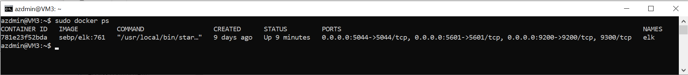

# Azure-Cloud-Security
A collection of work done during the first half of my Certification in Cybersecurity culminating in the creation of an Azure Cloud Environment

## Automated ELK Stack Deployment

The files in this repository were used to configure the network depicted below.

These files have been tested and used to generate a live ELK deployment on Azure. They can be used to either recreate the entire deployment pictured above. Alternatively, select portions of the playbook file may be used to install only certain pieces of it, such as Filebeat.

Below are links to the playbooks used:
(Ansible/Elk Playbook.yml)
(Ansible/Webserver Playbook.yml)
(Ansible/roles/Filebeat Playbook.yml)
(Ansible/roles/Metricbeat Playbook.yml)

This document contains the following details:
- Description of the Topology
- Access Policies
- ELK Configuration
  - Beats in Use
  - Machines Being Monitored
- How to Use the Ansible Build

### Description of the Topology

The main purpose of this network is to expose a load-balanced and monitored instance of DVWA, the D*mn Vulnerable Web Application.

Load balancing ensures that the application will be highly available, in addition to restricting unpermitted access to the network.

Load balancers protect against DDos attacks. The advantage of the jump box is an easy-to-access, protected single door into the internal virtual machines.

Integrating an ELK server allows users to easily monitor the vulnerable VMs for changes to the event logs and system matrix.

- Filebeat watches for file changes in specfied locations and pushes them to be indexed.

- Metricbeat records metric data on a target server such as CPU or memory or data related to services running on the server.

The configuration details of each machine may be found below.

| Name     | Function | IP Address | Operating System |
|----------|----------|------------|------------------|
| Jump-Box | Gateway  | 10.0.0.4   | Linux            |
| Web-1    | DVWA     | 10.0.0.5   | Linux            |
| Web-2    | DVWA     | 10.0.0.6   | Linux            |
| Elk VM   | Elk Stack| 10.1.0.4   | Linux            |

### Access Policies

The machines on the internal network are not exposed to the public Internet. 

Only the Jump-Box machine can accept connections from the Internet. Access to this machine is only allowed from the following IP addresses: my personal IP address only.

Machines within the network can only be accessed by the Jump-Box-Provisioner (10.0.0.4).
- The ELK Server is one such machine that can be ssh'd into via the Jump Box.

A summary of the access policies in place can be found in the table below.

| Name     | Publicly Accessible | Allowed IP Addresses  |
|----------|---------------------|-----------------------|
| Jump Box | Yes                 | my personal IP address|
| Web-1    | No                  | 10.0.0.4              |
| Web-2    | No                  | NA                    |
| Elk VM   | Yes                 | 23.99.180.159         |

# DO NOT FEEL GOOD HEEEEEEEEEEEEEEEEEEEEEEEEEEEELP

### Elk Configuration

Ansible was used to automate configuration of the ELK machine. No configuration was performed manually, which is advantageous because it removes the possibility of user error and it scales up very well.

The playbook implements the following tasks:
- The playbook first installs docker.io, python3-pip, and the docker module.
- The playbook then increases virtual memory and allocates that memory to the ELK Server.
- Then, a docker elk container is downloaded and launched.
- Finally, we allow docker to start on boot

The following screenshot displays the result of running `docker ps` after successfully configuring the ELK instance.

### Target Machines & Beats
This ELK server is configured to monitor the following machines:
- Web-1 : 10.0.0.5
- Web-2 : 10.0.0.6

We have installed the following Beats on these machines:
- Filebeats and Metricbeats were installed on these machines.

These Beats allow us to collect the following information from each machine:
- Filebeat collects system logs in specified locations. It was built to handle large volumes of data and be efficient in logging change. An example of something Filebeat would index is the last line of an index in a registry so if the network failed, on reboot Filebeat would know where to return to.
- Metricbeat collects metric data on a system about usage of items such as CPU usage or system process uptime. Metricbeat can interestingly also monitor other beats on a system or the ELK stack itself.

### Using the Playbook
In order to use the playbook, you will need to have an Ansible control node already configured. Assuming you have such a control node provisioned: 

SSH into the control node and follow the steps below:
- Copy the playbook file to the control node.
- Update the hosts file to include the IP address of the webservers and the ELK server.
- Run the playbook, and navigate to Kibana page for our ELK server (23.99.180.159:5601/app/kibana) to check that the installation worked as expected.

_As a **Bonus**, provide the specific commands the user will need to run to download the playbook, update the files, etc._
- TODO:
